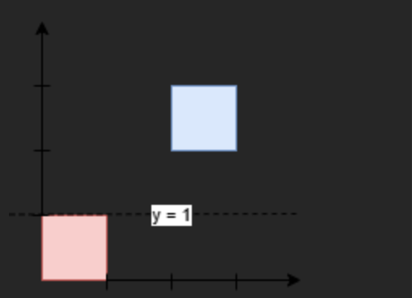
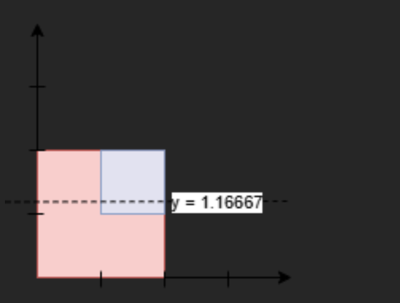

# 3453. Separate Squares

### 원문

- You are given a 2D integer array. Each represents the coordinates of the bottom-left point and the side length of a square parallel to the x-axis. `squares` `squares[i] = [x, y, l]`

- Find the minimum y-coordinate value of a horizontal line such that the total area of the squares above the line equals the total area of the squares below the line.

- Answers within of the actual answer will be accepted. `10^-5`

- **Note**: Squares may overlap. Overlapping areas should be counted multiple times.

### 국문

- 2차원 정수 배열이 주어집니다. 각각은 왼쪽 아래 점의 좌표와 x축에 평행한 정사각형의 변의 길이를 나타냅니다. `squares` `squares[i] = [x, y, l]`

- 수평선의 최소 y좌표값을 찾아서, 선 위의 정사각형의 총 면적이 그 아래 정사각형의 총 면적과 같아집니다.

- 실제 답변 내에 있는 답변은 받아들여집니다. `10^-5`

- **참고**: 정사각형의 칸은 겹칠 수 있습니다. 겹치는 영역은 겹치는 횟수만큼 세어야 합니다.

### 입출력 형식

- example 1.
  - Input: squares = [[0, 0, 1], [2, 2, 1]]
  - Output: 1.00000
  - Explanation:
    
    - Any horizontal line between and will have 1 square unit above it and 1 square unit below it. The lowest option is 1. `y=1` `y=2`
- example 1.
  - Input: squares = [[0, 0, 2], [1, 1, 1]]
  - Output: 1.16667
  - Explanation:
    
    - The areas are:
      - Below the line: `7/6 * 2 (Red) + 1/6 (Blue) = 15/6 = 2.5`
      - Above the line: `5/6 * 2 (Red) + 5/6 (Blue) = 15/6 = 2.5`
    - Since the areas above and below the line are equal, the output is `7/6 = 1.16667`
